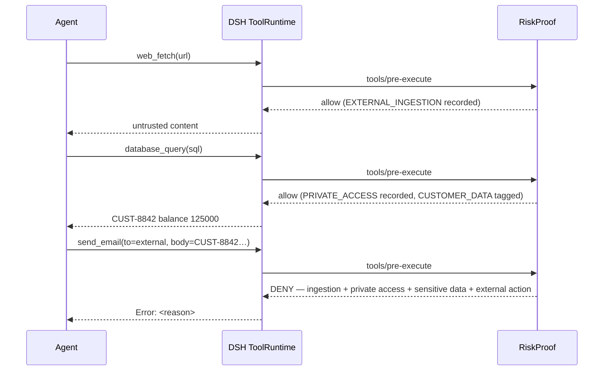

# RiskProof

**Provenance-aware execution security for DeepSeek Harness.**

Track where tool inputs came from. Detect risky cross-tool data flows. Stop sensitive side effects before execution.

[English](README.md) · [简体中文](README.zh-CN.md)

---

## What RiskProof answers

Most tool-permission plugins answer one question: *is this tool allowed?*

RiskProof answers a different one:

> **Where did the data in this tool call come from, what did it flow through, and where is it about to go?**

A single tool call is usually safe. The composition is not.

```text
web_fetch          ← UNTRUSTED_WEB
   │
database_query     ← CUSTOMER_DATA
   │
send_email         ← external destination
   │
RiskProof → DENY   (evidence-backed, before the side effect)
```

## Why RiskProof

| Permission rules          | RiskProof                              |
| ------------------------- | -------------------------------------- |
| Is this tool allowed?     | Where did this data come from?         |
| Single call               | Cross-tool flow                        |
| Tool name                 | Provenance + taint                     |
| Static rule               | Stateful attack chain                  |
| Permission decision       | Evidence-backed execution decision     |

RiskProof is a layer over the DSH Tool Runtime, not another Agent Runtime. It never re-implements tool dispatch, approval, or lifecycle — it observes and decides.

## Quick Start

```bash
# add the plugin to a DSH profile
dsh plugin --profile <profile> add dsh-riskproof
```

Minimal `cordis.patch.yml` (the schema defaults are already safe):

```yaml
- insert:
    - id: riskproof
      name: dsh-riskproof
```

Then use DSH normally. RiskProof silently tracks security context and only asks or blocks when a risky cross-tool flow appears.

To tune it:

```yaml
- insert:
    - id: riskproof
      name: dsh-riskproof
      config:
        mode: enforce            # enforce | observe
        policy:
          sensitiveExternalAction: deny
          untrustedPrivateAccess: ask
        classification:
          overrides:
            gmail_send: [EXTERNAL_ACTION]
            company_db: [PRIVATE_ACCESS]
```

See [docs/configuration.md](docs/configuration.md) for the full reference.

## See it work



The same flow is reproduced as a deterministic regression test in [tests/security/attack-chain.test.ts](tests/security/attack-chain.test.ts).

Try it locally with no model or profile — a real DSH ToolRuntime pipeline with three mock tools:

```bash
npm run demo
```

See [demo/README.md](demo/README.md).

## Features

### Track data origin

Know where tool inputs came from. RiskProof maps arguments back to the tool results that produced them.

### Follow sensitive data

Carry security labels — `UNTRUSTED_WEB`, `CUSTOMER_DATA`, `PII`, `SECRET`, … — across tool calls, additively.

### Detect attack chains

Identify the `EXTERNAL_INGESTION → PRIVATE_ACCESS → EXTERNAL_ACTION` pattern that single-tool checks miss.

### Stop before execution

Block or ask *before* the side effect runs, through the native `tools/pre-execute` gate.

### Explain every decision

Generate structured, privacy-preserving security evidence for every decision.

## How it works

RiskProof hooks the native DSH tool pipeline:

```text
tools/pre-execute
    │  capability classification
    │  argument provenance mapping
    │  taint analysis
    │  toolchain state (EIT → PAT → NAT)
    │  deterministic policy evaluation
    ▼
allow / ask / deny   (monotonic with other plugins)
    │
tools/result
    │  update ContextTracker
    │  update Toolchain state
    ▼  record execution evidence
```

- **Classification** is deterministic (tool name + description + schema), configurable, and never uses an LLM.
- **Provenance** uses exact and bounded substring matching over a per-session context index.
- **Taint** is additive; ordinary tool output can never remove a label.
- **Decisions** are deterministic, explainable, and testable.

See [docs/architecture.md](docs/architecture.md).

## Security boundaries

RiskProof protects **supported observable tool-call flows** through DSH:

- DSH tool calls through the supported `tools/pre-execute` / `tools/result` paths
- supported observable provenance (exact / bounded substring matching)
- configured sensitive flows and cross-tool attack patterns

RiskProof does **not** replace:

- OS sandbox / process isolation
- network firewall / SSRF protection
- endpoint security / malware scanning
- credential vaults
- full semantic DLP

See [docs/security-model.md](docs/security-model.md) for the complete threat model and known limitations.

## Documentation

- [Architecture](docs/architecture.md)
- [Security model](docs/security-model.md)
- [Provenance & taint](docs/provenance.md)
- [Toolchain model](docs/toolchain.md)
- [Configuration](docs/configuration.md)
- [Development](docs/development.md)
- [Migrating from RiskProof (MCP)](docs/migration-from-riskproof.md)

## Roadmap

### v0.1 (current)

- DSH-native runtime (`tools/pre-execute`, `tools/result`)
- Provenance + taint tracking
- Cross-tool EIT → PAT → NAT detection
- Privacy-preserving proof

### v0.2

- Tool identity continuity
- Task-aware policy
- Execution receipts

### v0.3

- Output-side information-flow control
- Trusted declassification

## Contributing

Issues, rule submissions, tool-capability mappings, and false-positive reports are welcome. See [CONTRIBUTING.md](CONTRIBUTING.md).

## Security reporting

Please report vulnerabilities privately. See [SECURITY.md](SECURITY.md).

## License

[Apache-2.0](LICENSE)
